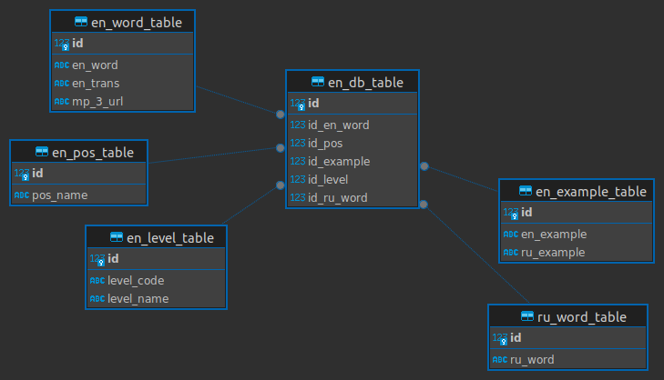

# Проектная работа «Обучалка английскому языку» (чат-бот Telegram)

## Описание проекта

### Цель проекта

Разработка базы данных Telegram-бота для изучения английского языка.

### Вводные параметры

- Название базы данных относительно Postgres.
- Имя пользователя Postgres.
- Пароль пользователя Postgres.
- Токен для подключения к чат-боту Telegram (можно приобрести у [BotFather](https://t.me/botfather, 'BotFather')).

### Ожидаемый результат

Запуск чат-бота Telegram, обучающего пользователя английскому языку. В процессе работы программы обучающие могут осуществить одно из следующих возможных действий:

- выбор одного из четырех вариантов перевода английского слова нажатием клавиши.
- добавление английского слова в персональную базу данных (БД) пользователя Telegram нажатием клавиши "Добавить слово".
- удаление английского слова из персональной БД пользователя Telegram нажатием клавиши "Удалить слово".

### На какой версии Python выполнен проект?

Проект выполнен на Python 3.9.10 в Visual Studio Code (64-bit, Linux Ubuntu). Код для запуска чат-бота находится в файле main.py, а библиотеки для установки - в файле requirements.txt.

### Что следует сделать перед запуском программы?

Перед запуском кода следует удостовериться, что:
- заведен проект в Visual Studio Code или другом IDE.
- размещены все файлы в папке с проектом, находящиеся в текущем репозитории.
- установлены все библиотеки, расположенные внутри файла requirements.txt.

### Структура проекта

- `app_use_instruction`: папка с инструкцией по использованию приложения.

- `code_documentation`: папка с документацией к коду, написанному в рамках текущего проекта.

- `data`: папка с данными, относительно которых формируется БД пользователя Postgres:
  - `database_csv`: папка, содержащая CSV-файл с 4000 уникальными английскими словами (`database.csv`). Относительно `database.csv` заполняется БД пользователя Postgres.
  - `dictionary_data_csv`: папка, содержащая данные, загруженные по отдельности из онлайн-словарей [Oxford](https://www.oxfordlearnersdictionaries.com/ "Сборник слов Oxford 5000") и [Promt](https://www.online-translator.com/translation/english-russian/, 'Онлайн-словарь PROMT.One'). Данные задействованы для формирования CSV-файла `database_csv`.
  - `eng_audio_files_mp3`: папка, включающая MP3-файлы с произношением английских слов. MP3-файлы запускаются в чат-боте.

- `data_formation`: папка с модулями, ориентированными на извлечение данных посредством парсинга веб-сайтов.

- `database_formation`: папка с модулями, нацеленными на формирование и заполнение БД пользователя Postgres.

- `database_schema`: папка, содержащая схему БД пользователя Postgres в форматах drawio и png. 

- `telebot_connection`: папка с модулями, ориентированными на запуск чат-бота Telegram и обеспечение его работы.

- `data.py`: файл обобщающий  функционал, заданный в папке `data_formation`.

- `database.py`: файл обобщающий  функционал, заданный в папке `database_formation`.

- `main.py`: файл обобщающий  функционал, заданный в папках `telebot_connection` и `database_formation`. Можно также задействовать функционал папки `data_formation` (см. пункт "запуск программы").

## Запуск программы

Для запуска кода в файле `main.py` необходимо в разрезе функции `main_function` ввести: 

- `DB_NAME` - название базы данных в Postgres.
- `USER` - имя пользователя Postgres, относительно которого формируется БД.
- `PASSWORD` - пароль пользователя Postgres.
- `TOKEN` - токен для подключения к чат-боту Telegram.

Вместе с представленными выше переменными можно также заполнить параметр `form_data`. При вводе `True` он начнет реализацию всего функционала, содержащегося в папке `data_formation`.

**Спойлер:** при вводе `form_data=True` реализация всех функций папки `main_function` займет некоторое время (около 1,5 часа), поскольку в файл `database_csv` было включено порядка более 4000 уникальных английских слов с примерами их использования. Таким образом `form_data=True` стоит включать функцию только в необходимых случаях (по умолчанию `form_data=False`).

```python
if __name__ == '__main__':
    
    DB_NAME = 'english_bot_db'
    USER = 'postgres'
    PASSWORD = 'postgres'
    TOKEN = '1111111111:AAAaaaAAaaaa1aAaAaAAAaAA-aaAAAaAa11'
    
    # Стандартная работа функции main_function
    main_function(DB_NAME, USER, PASSWORD, TOKEN)

    # Задействование функционала папки data_formation и файла data.py
    # main_function(DB_NAME, USER, PASSWORD, TOKEN, True)
```

## Алгоритм работы программы
В результате стандартного запуска представленного выше кода (т.е. при `form_data=False`) будут осуществлены следующие последовательные шаги.

### **Шаг 1. Формирование базы данных в Postgres** 

Формируется БД в случае ее отсутствия. Если БД имеется, то шаг пропускается с извещением о ее наличии в Postgres.

### **Шаг 2. Чтение данных**

Проводится чтение данных, содержащихся в файле `database.csv`.

### **Шаг 3. Формирование структуры таблиц базы данных**

Создается структура взаимосвязанных таблиц, относительно которых строится единая схема, представленная на рисунке ниже.



- **`en_word_table`**: таблица, содержащая уникальные английские слова (`en_word`), транскрипцию слов (`en_trans`) и URL-ссылку на MP3-файл с произношением слова на английском языке (`mp_3_url`).

- **`en_pos_table`**: таблица, учитывающая часть речи английского слова (`pos_name`). В текущем случае предполагаются существительные, глаголы и прилагательные.

- **`en_level_table`**: требуемый уровень знания английского языка в формате кода (`level_code`, *A1-C2*) и его названия (`level_name`, *beginner-proficiency*).

- **`en_example_table`**: таблица, включающая пример предложений на английском языке и его перевод на русский (`en_example`, `ru_example`).

- **`ru_word_table`**: таблица, содержащая переводы английских слов на русский (`ru_word`).

В случае, если структура таблиц сформирована, шаг пропускается.

### **Шаг 4. Подготовка данных**

Формируются списки словарей, относительно которых в процессе реализации шага №5 заполняются таблицы из шага №3.


### **Шаг 5. Заполнение таблиц базы данных Postgres**

Пустые таблицы заполняются данными, полученными из шага №4. Если таблицы заполнены, то появится сообщение `"IntegrityError: данные по значениям уже существуют"` и программа перейдет к следующему шагу.

### **Шаг 6. Извлечение данных из БД, находящейся в Postgres** 

Осуществляется извлечение заполненных данных из таблиц шага №3.

### **Шаг 7. Запуск чат-бота Telegram** 

Запуск чат-бота. Данные, извлеченные из БД Postgres, будут задействованы для отгадывания одного из четырех предлагаемых вариантов английских слов. Каждый пользователь Telegram может дополнять или изменять собственную БД.
