# Запуск чат-бота

- После подключения к чат-боту Telegram нажимаем на клавишу `Start`.

&nbsp;

- Отгадываем правильный перевод английского слова.
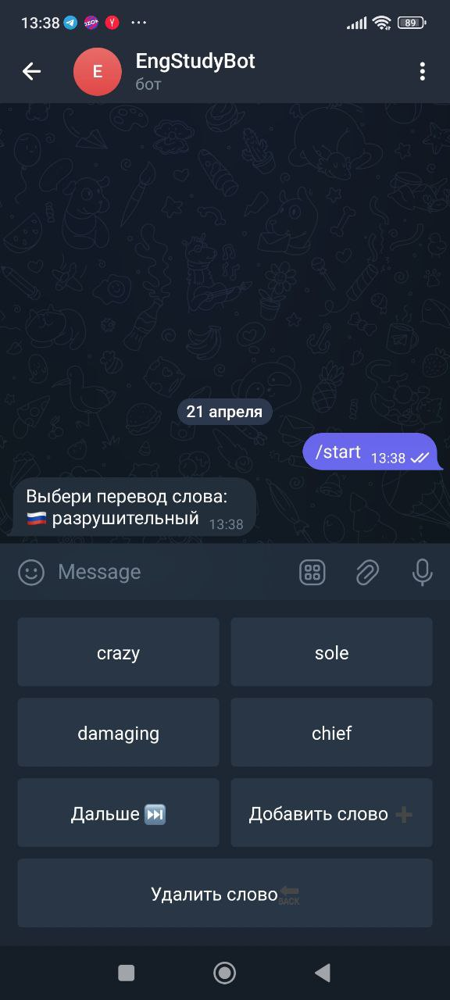

---------------------

# Выбор варианта ответа и клавиша "Дальше"

- При выборе неправильного варианта ответа появится крестик.
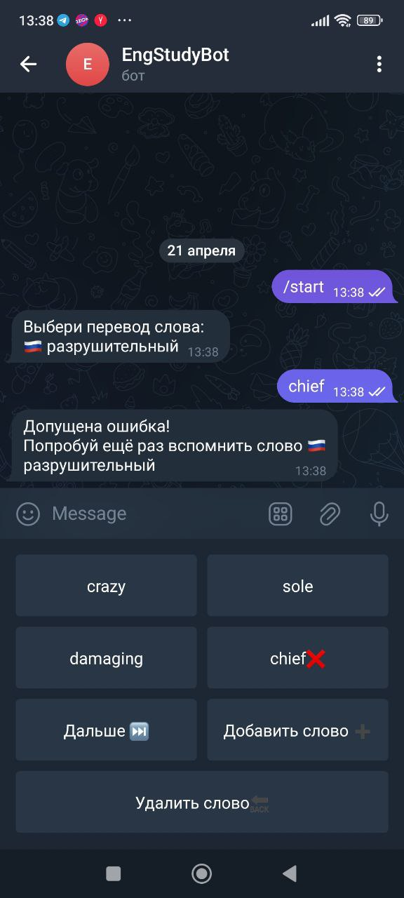
&nbsp;

- При выборе корректного варианта ответа появятся MP3-файл и пример использования слова в предложении.
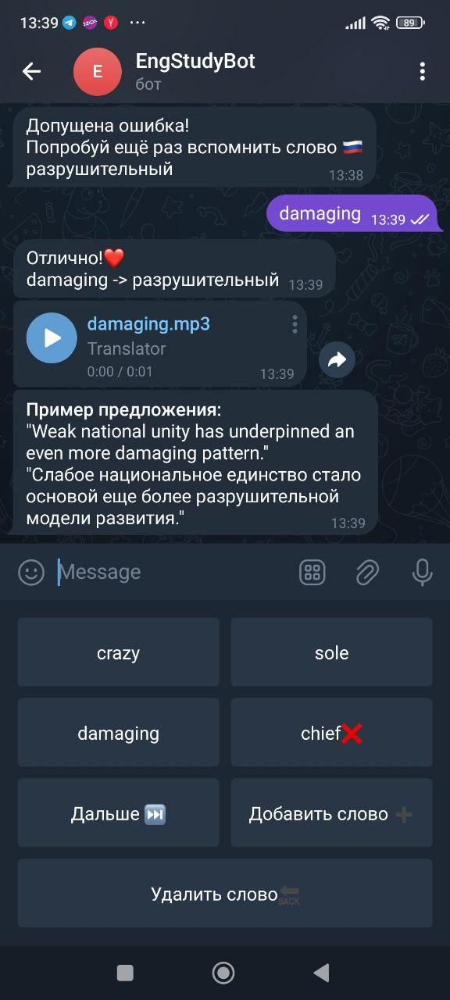
&nbsp;

- Для продолжения пользователем нажимается клавиша `"Дальше"`.
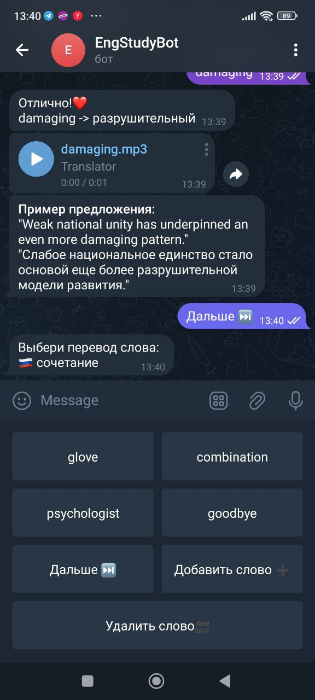

---------------------

# Клавиша "Добавить слово"

- После нажатия на клавишу `"Добавить слово"` чат-бот просит пользователя ввести английское слово, которое необходимо добавить в собственную БД.
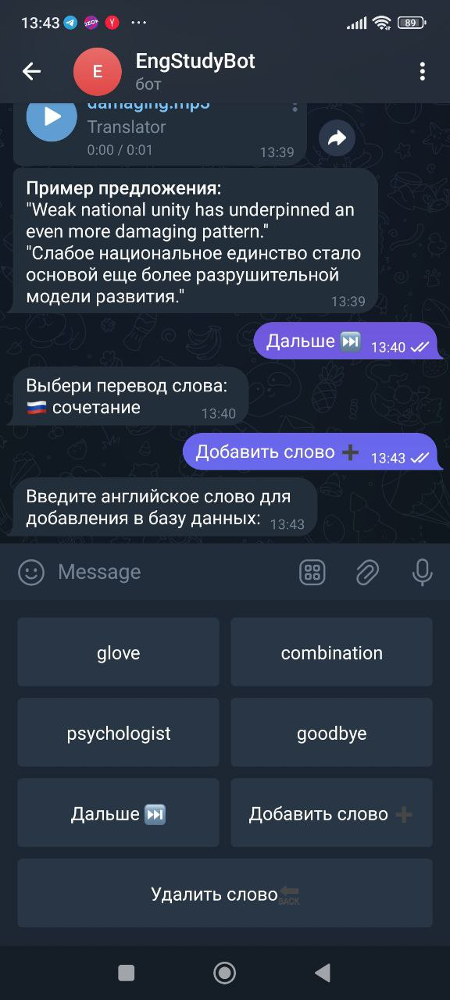
&nbsp;

- При добавлении существующего слова чат-бот сообщит о его наличии в базе данных пользователя.
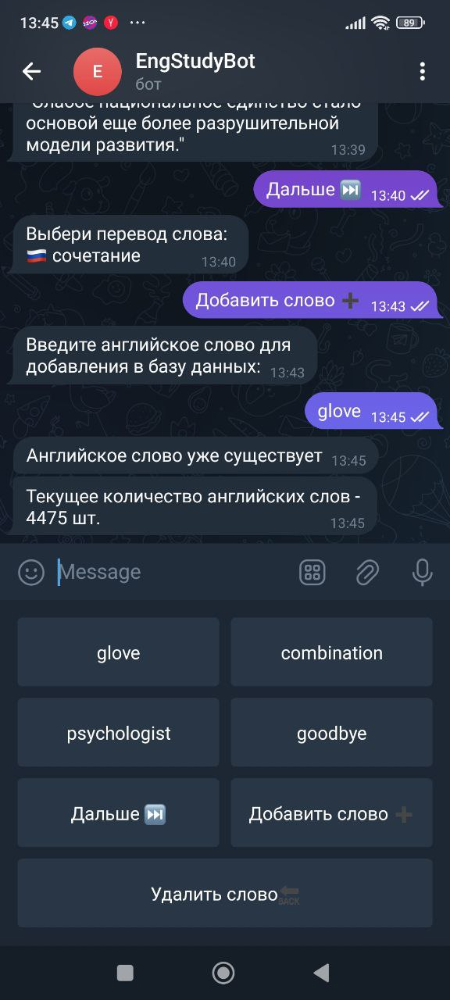
&nbsp;

- Непредусмотренное нажатие клавиш, содержащих команды `"Дальше"`, `"Добавить слово"` и `"Удалить слово"`, приводит к невозможности обработки их чат-ботом. 
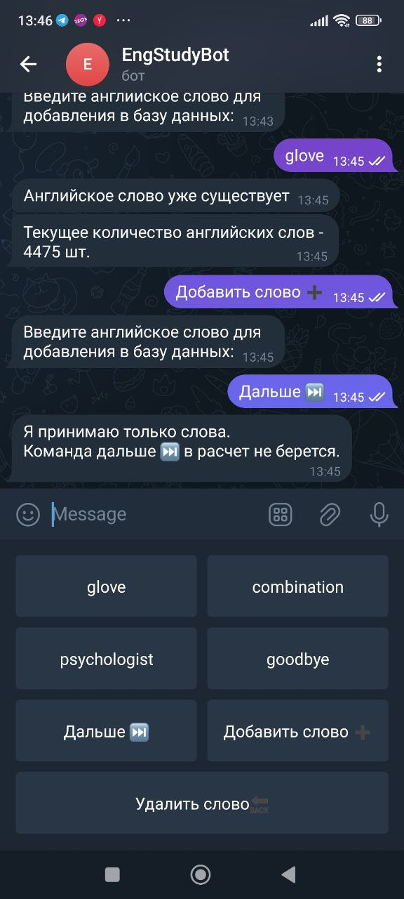
&nbsp;

- При вводе нового английского слова, существующего в БД онлайн-словарей (Oxford, Promt.One), чат-бот автоматически добавляет его в БД пользователя Telegram.
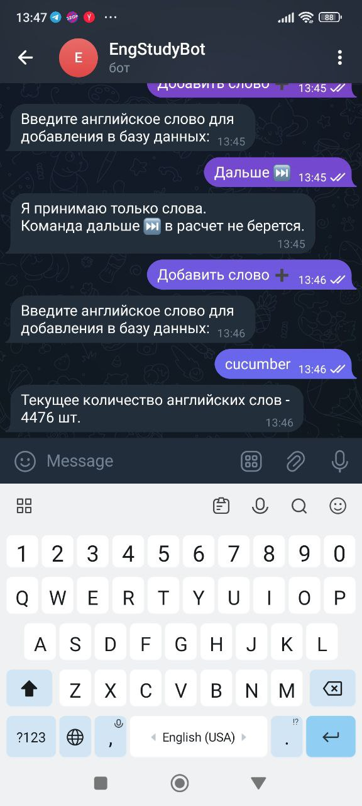
&nbsp;

- При вводе нового английского слова, отсутствующего в БД онлайн-словарей (Oxford, Promt.One), чат-бот просит пользователя ввести перевод английского слова. 
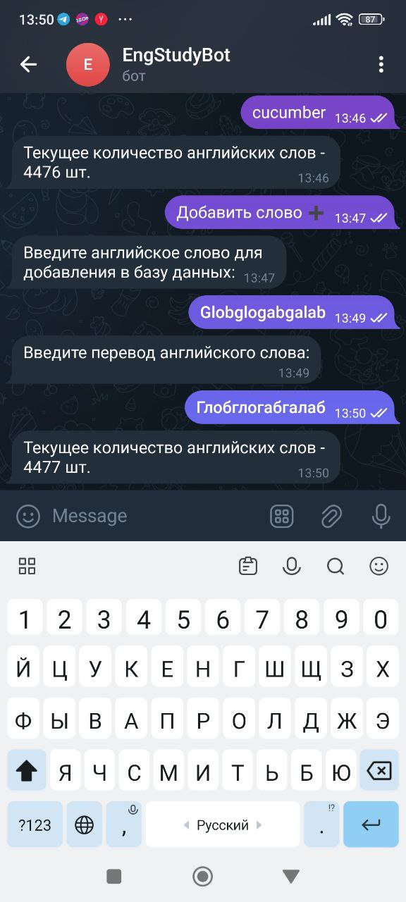
&nbsp;

- При вводе русского слова вместо английского чат-бот просит пользователя Telegram нажать на клавишу `Добавить слово` и повторить попытку.
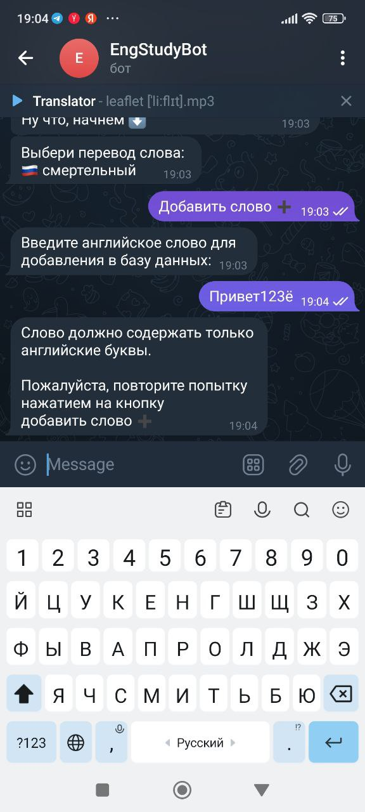
&nbsp;

- При вводе английского слова вместо русского чат-бот просит пользователя Telegram нажать на клавишу `Добавить слово` и повторить попытку.
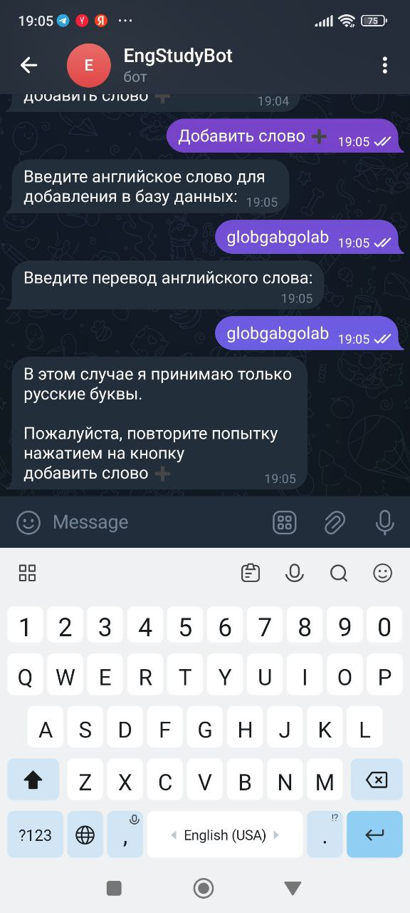
&nbsp;

---------------------

# Клавиша "Удалить слово"

- Для удаления английского слова из БД пользователя Telegram необходимо нажать на клавишу `"Удалить слово"`.
&nbsp;

- Непредусмотренное нажатие клавиш, содержащих команды `"Дальше"`, `"Добавить слово"` и `"Удалить слово"`, приводит к невозможности обработки их чат-ботом. 
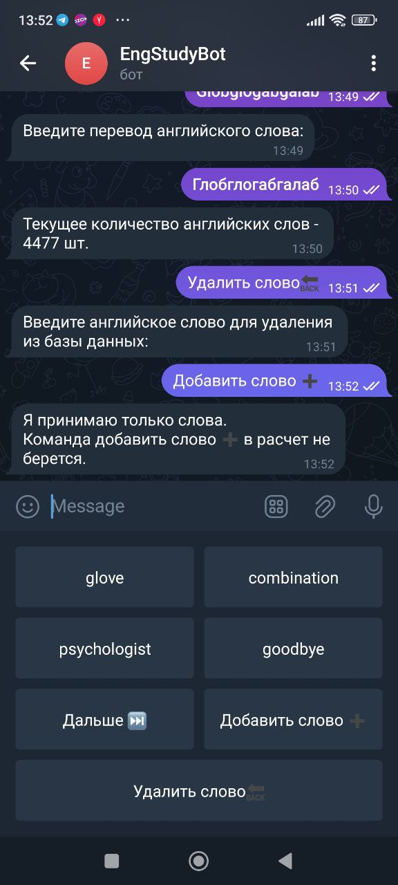
&nbsp;

- При отсутствии английского слова в БД пользователя Telegram чат-бот извещает его о невозможности выполнить запрошенную операцию.
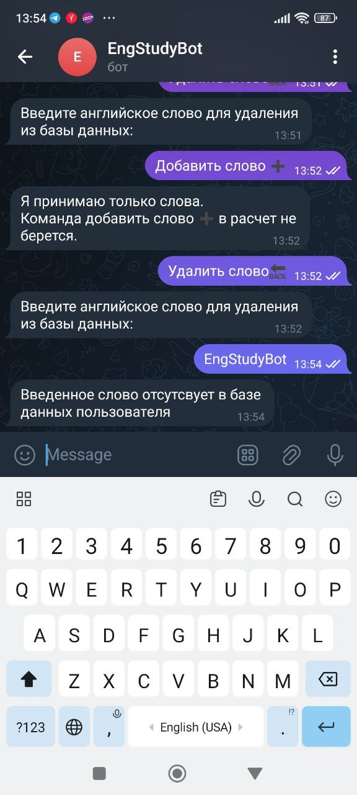
&nbsp;

- При наличии введенного английского слова в БД пользователя Telegram чат-бот удаляет его и демонстрирует количество оставшихся английских слов.
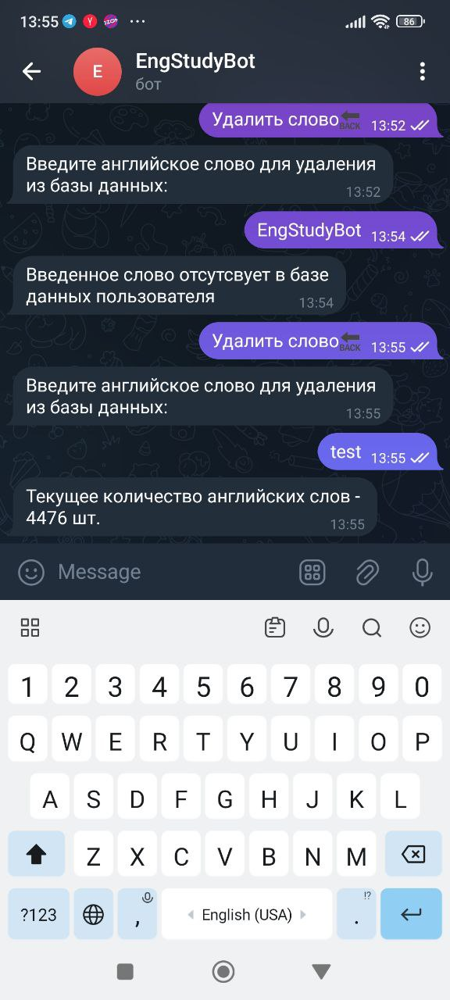
&nbsp;

- При вводе русского слова вместо английского чат-бот просит пользователя Telegram нажать на клавишу `Удалить слово` и повторить попытку.
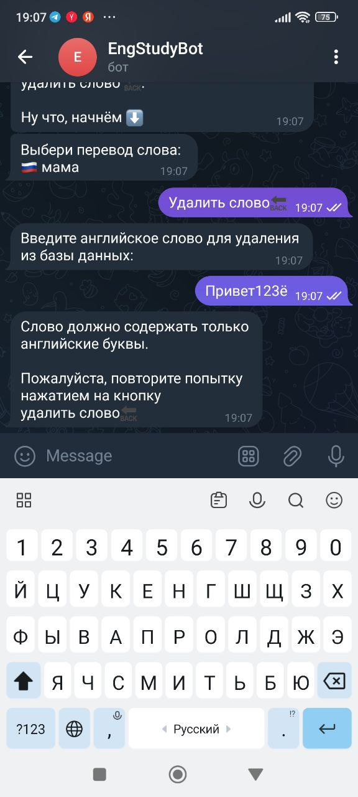
&nbsp;